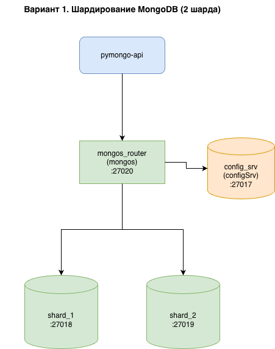
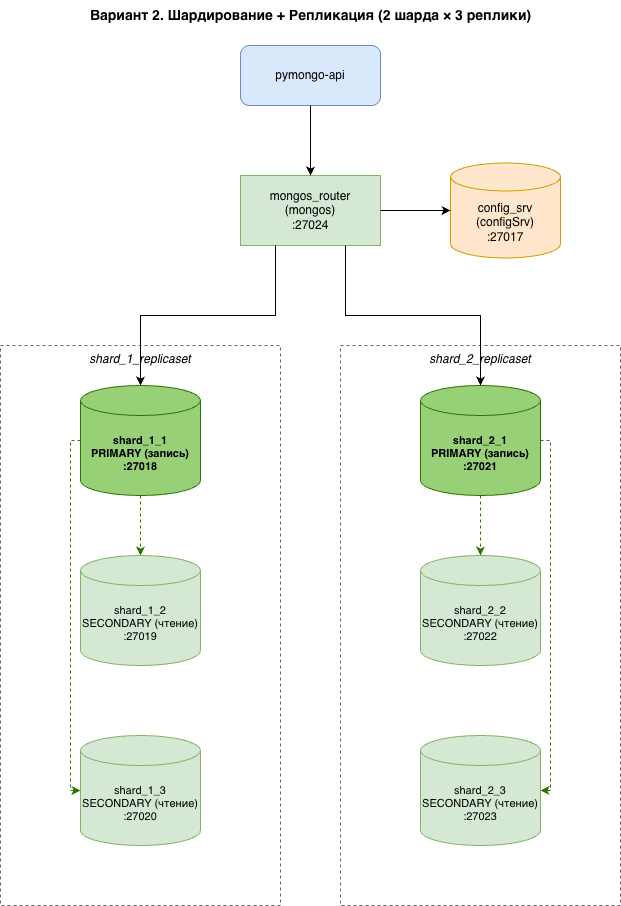
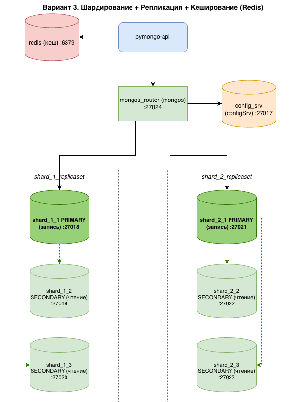
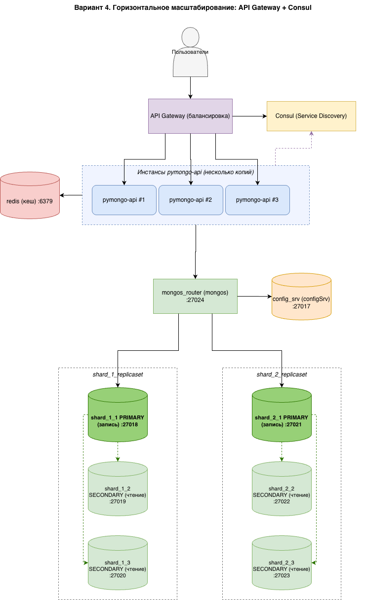
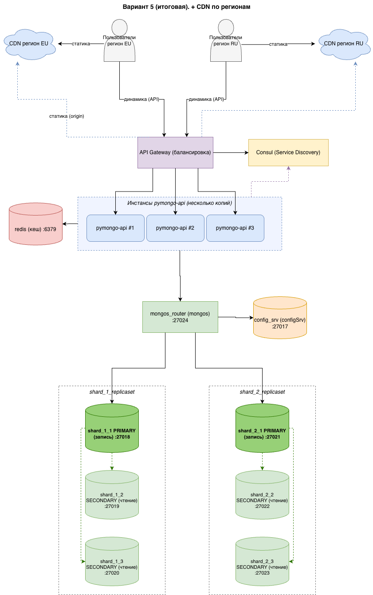

# Проектная работа 4 спринта — «Мобильный мир» (Black Friday)

Шардирование, репликация и кеширование MongoDB для приложения `pymongo-api`
(образ `kazhem/pymongo_api:1.0.0`).

---

## Задание 1. Планирование

Схемы архитектуры по этапам.

### Шардирование



### Шардирование + репликация



### Шардирование + репликация + кеширование



### Service Discovery и балансировка (API Gateway + Consul)



### Итоговая схема (+ CDN)



---

## Задание 2. Шардирование — [`mongo-sharding/`](mongo-sharding/)

Кластер из двух шардов: `config_srv`, `shard_1`, `shard_2`, `mongos_router` и приложение.

```shell
cd mongo-sharding
docker compose up -d
./scripts/mongo-init.sh
```

Открыть <http://localhost:8080/>.

---

## Задание 3. Репликация — [`mongo-sharding-repl/`](mongo-sharding-repl/)

Каждый шард — replica set из трёх узлов (`shard_1_replicaset`, `shard_2_replicaset`).

```shell
cd mongo-sharding-repl
docker compose up -d
./scripts/mongo-init.sh
```

Открыть <http://localhost:8080/>.

---

## Задание 4. Кеширование — [`sharding-repl-cache/`](sharding-repl-cache/)

Шардирование + репликация + Redis. Кешируется эндпоинт `/<collection>/users`.

```shell
cd sharding-repl-cache
docker compose up -d
./scripts/mongo-init.sh
```

Открыть <http://localhost:8080/>. Проверить кеш:

```shell
time curl -s http://localhost:8080/helloDoc/users -o /dev/null   # 1-й запрос ~1 c
time curl -s http://localhost:8080/helloDoc/users -o /dev/null   # повторный <100 мс
```

---

## Задание 5. Service Discovery и балансировка

Несколько инстансов `pymongo-api` за API Gateway (балансировка), Consul для
регистрации и обнаружения инстансов. Схема — в Задании 1.

---

## Задание 6. CDN

CDN по регионам для доставки статического контента; динамические запросы идут
напрямую в API Gateway. Схема — в Задании 1.
